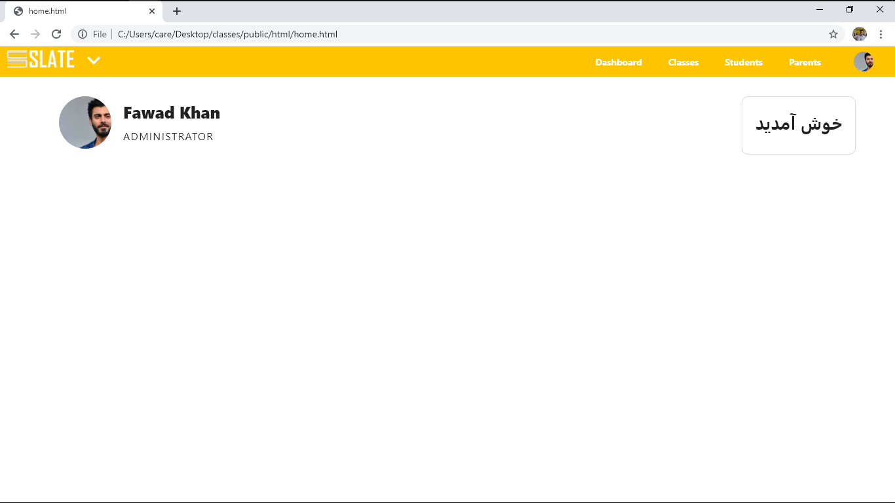

### Collaborators
Shahab Ul Hassan, Maaz Asad, Haroon Ali, Saad Bazaz

## Abstract
The task provided to us was to design and develop a database for an NGO ‘Hamary Bachchey’. First of all, we analyzed the system requirements for this given project. Then we made few assumptions regarding the design. According to those assumptions we represented the requirement into logical design using ER model. 

## Web Interface
The web interface features a library of very basic HTML/CSS/JS elements built from scratch with minimum help from the Internet. The overall layout has been kept simple for ergonomics, minimalism and easy understandability. We have borrowed concepts from Material and Bootstrap without using either of the respective UI libraries.

## Instructions
Place this entire folder in htdocs of your Zendcore folder, then access from
localhost:<ZENDCORE_PORT_NUMBER>/home.php
If you are running without Oracle 11g, You may need to remove the first tag of PHP from each file which contains the Oracle connection.
